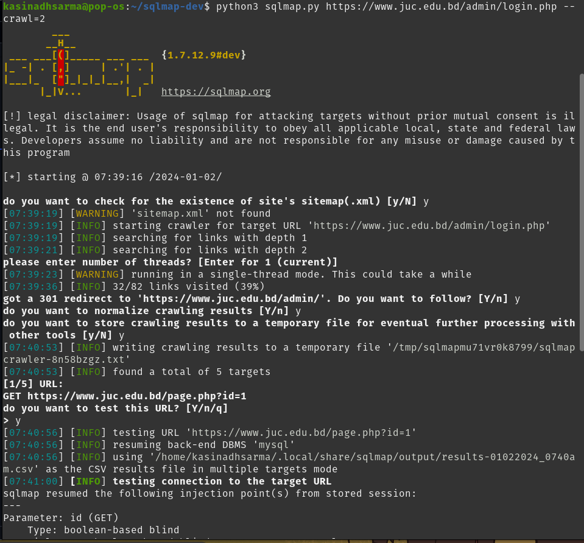

Today, our topic is the juc.edu.bd website. I explored this website following the guidelines provided by my instructor, who assigned a vulnerability assessment task. Initially, I conducted a WHOIS lookup to identify the website's origin.

After confirming that this is a Bangladeshi website, I researched potential vulnerabilities, particularly in the login page. I used tools like SQLMap to investigate these vulnerabilities.

# comming soon of this website vulnerblity