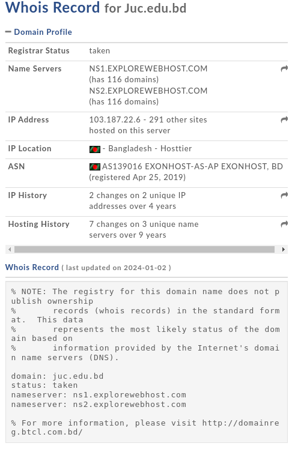
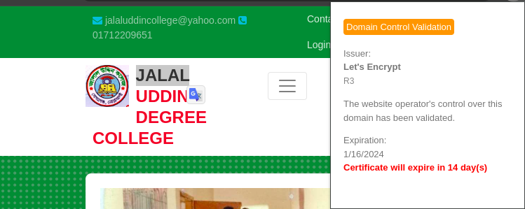
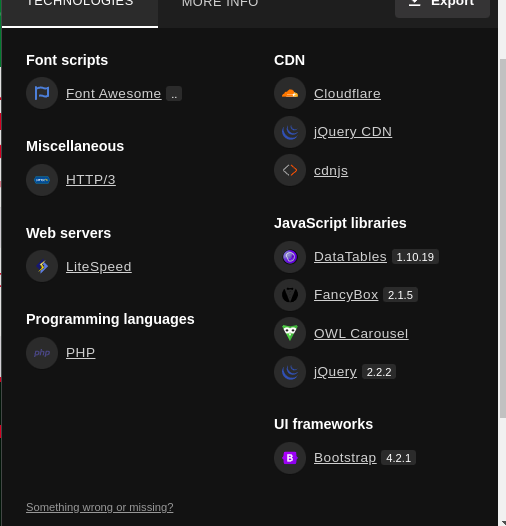
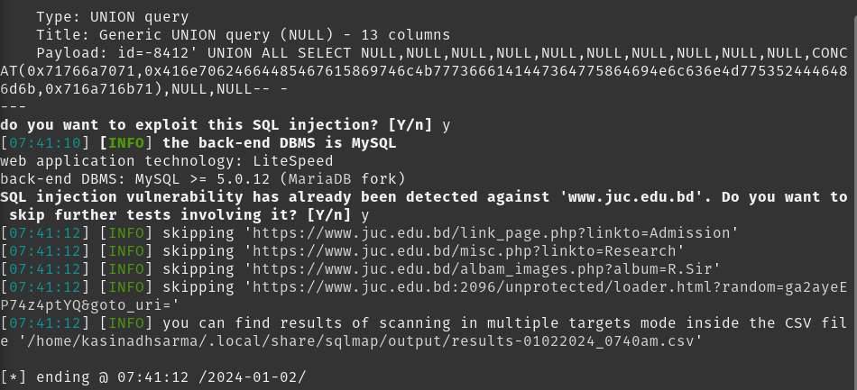
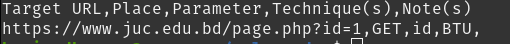
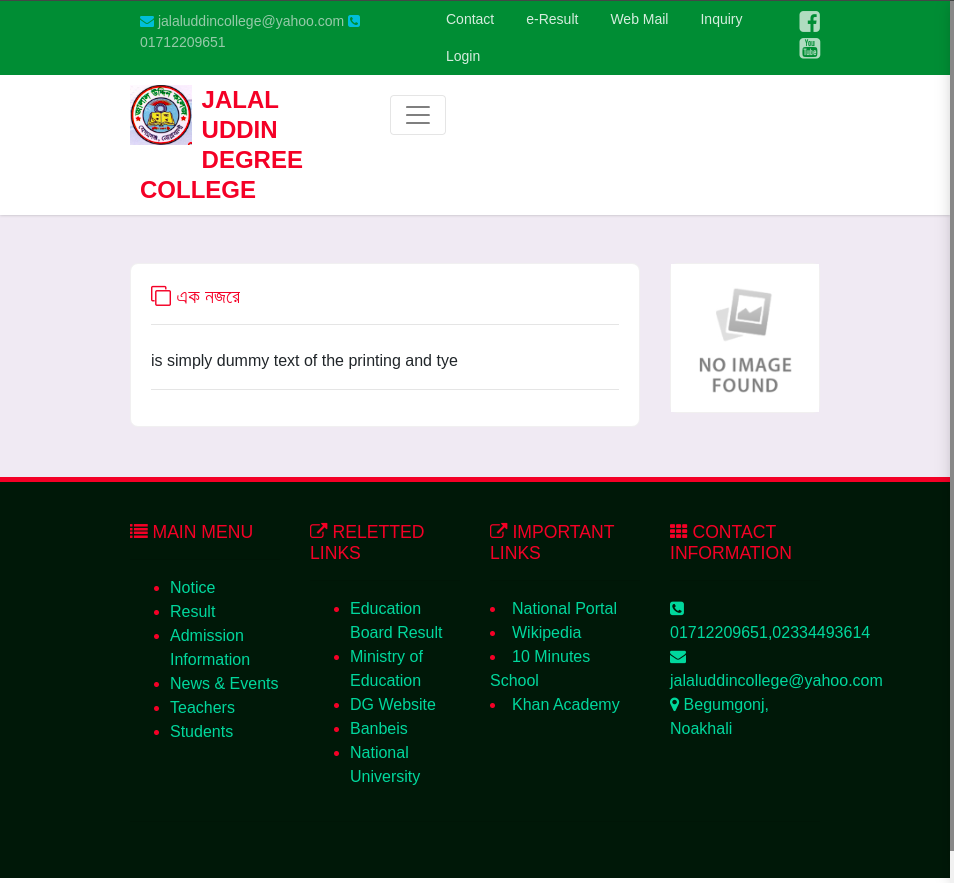
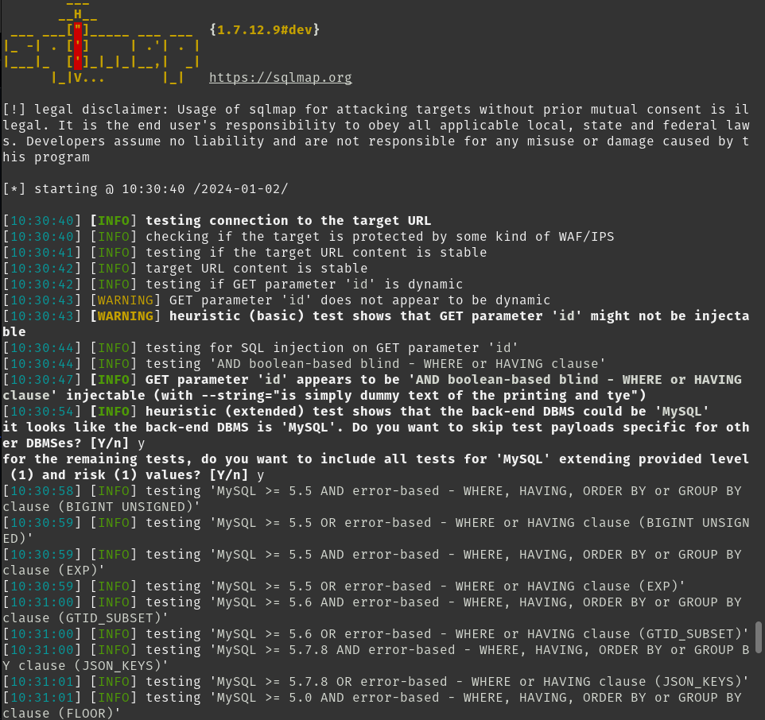
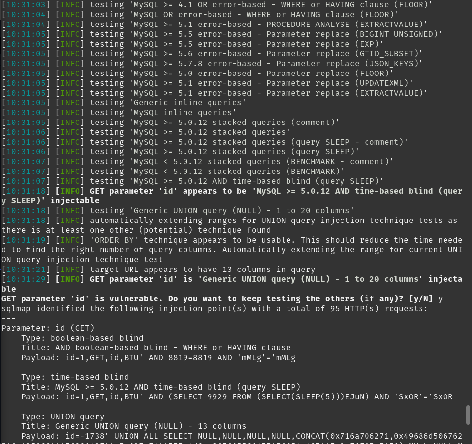
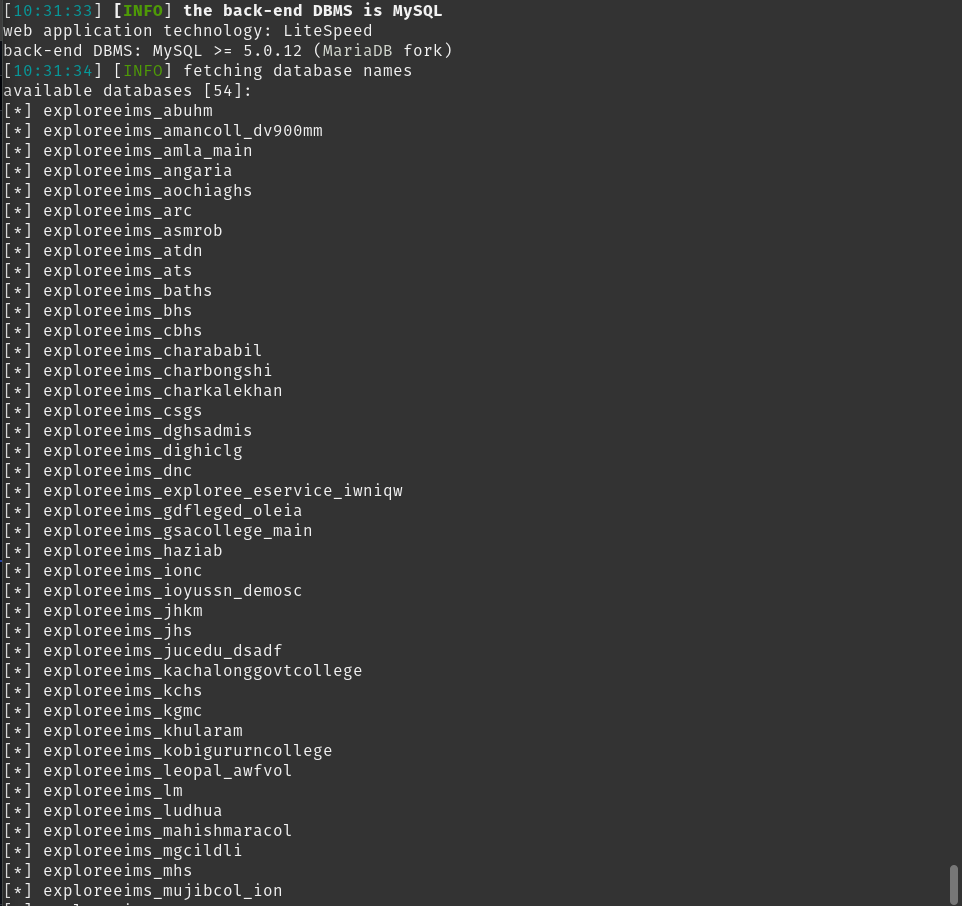

🎯 **Today's Focus: The juc.edu.bd Website** 🎯

I embarked on exploring the juc.edu.bd website, adhering to the guidelines set by my instructor for a vulnerability assessment task. My initial step was to conduct a WHOIS lookup to ascertain the website's origins.

🔍 

Upon discovering that this is a Bangladeshi website, I researched information-oriented aspects such as domain validation, which is valid until January 16, 2024.

📆 

Further investigation using Wappalyzer revealed that the website is built using PHP.

💻 

After thoroughly examining the website, I focused on the login page. By utilizing SQLMap, I identified several vulnerabilities.

🔓 

🔓 

Subsequent research led me to a file named `results-01022024_0740am.csv`. This file contained a target link.

🎯 

Upon opening this link, I was directed to a specific webpage.

🌐 

With suspicions of a database service, I conducted research using SQL. The command I used was:

```bash
python3 sqlmap.py https://www.juc.edu.bd/page.php?id=1,GET,id,BTU --dbs
```

This command helped me uncover parameter-related vulnerabilities.

💡 

💡 

💡 

Although we have retrieved data, we will not misuse it. Now, let's discuss how to remedy this SQL injection and enhance the website's security.

1. **Immediate Mitigation:**
   - 🛠 Temporarily disable the vulnerable parameter to prevent access to the 'id' parameter in the page.php file.
   - ✅ Implement input validation and sanitization to ensure data conforms to expected formats and lengths.
   - 🛡 Deploy a Web Application Firewall (WAF) to filter out malicious traffic.

2. **Code Fix:**
   - 🔎 Inspect the code handling the 'id' parameter to find out how it is being used in SQL queries.
   - 🚫 Use prepared statements with parameterized queries for all dynamic queries.
   - 🧹 If prepared statements aren't an option, meticulously escape user input.

3. **Penetration Testing:**
   - 🕵️‍♂️ Engage in thorough penetration testing to uncover any additional vulnerabilities.
   - ⏱ Prioritize and address all identified vulnerabilities promptly.

4. **Continuous Monitoring:**
   - 📈 Implement a vulnerability management program to regularly scan for new vulnerabilities.
   - 🔔 Stay informed about security updates for your web application framework and database.

5. **Additional Recommendations:**
   - 🔄 Update the web application and database to the latest versions containing security fixes.
   - 🛡 Conduct a comprehensive security review to identify and fix potential weaknesses.
   - 📚 Educate developers on secure coding practices to prevent future vulnerabilities.

6. **Remember:**
   - 🤝 If you're not the website's owner or administrator, contact them to responsibly disclose the vulnerability.
   - 🤫 Refrain from publicly sharing sensitive information that could assist malicious actors.

7. **Cyber City:**
   - 🏙 Discuss this vulnerability to prevent it in future iterations of the Cyber City website.
   - 👨‍💻 Cyber City will come soon.
